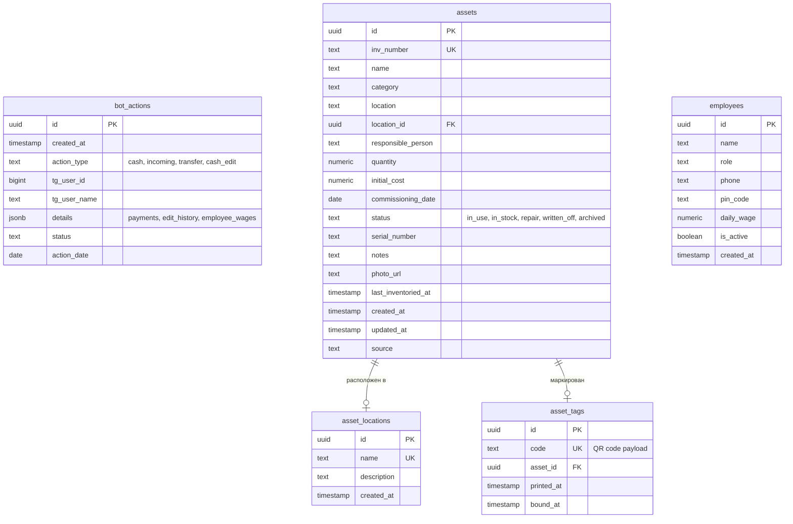
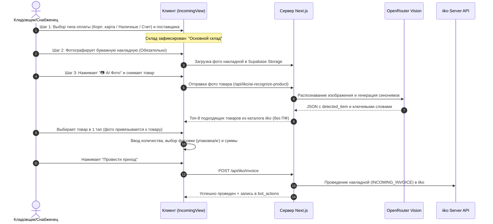

# ARCHITECTURE.md — Техническая архитектура и документация проекта Lokmaco Web

---

## 1. Краткое описание
**Lokmaco Web (`web_lokmaco3`)** — это специализированная ERP/B2B веб-платформа для автоматизации складского учета, кассовых аудитов, инвентаризации основных средств (ОС), P&L-аналитики и контроля ресторанной сети «Lokmaco» (Ташкент/Фергана). Система интегрирует **iiko REST API**, **iikoWeb API**, базу данных **Supabase (PostgreSQL)**, **OpenRouter AI (Vision/LLM)** и **Telegram Bot API**, предоставляя ролевой доступ для бухгалтеров, директоров, кассиров, поваров и снабженцев.

---

## 2. Технологический стек

| Категория | Технология / Библиотека | Версия | Назначение |
| :--- | :--- | :---: | :--- |
| **Язык** | JavaScript (Node.js ES Modules / React JSX) | Node 20+ | Основной язык фронтенда и серверных API-роутов |
| **Фреймворк** | Next.js (App Router, Serverless Functions) | `14.2.0` | SSR, API Endpoints, роутинг, оптимизация сборки |
| **UI Библиотека** | React / React DOM | `18.3.0` | Компонентный интерфейс |
| **Стилизация** | Vanilla CSS, CSS Variables, Responsive Grid/Flex | — | Кастомная адаптивная дизайн-система (Mobile First) |
| **База данных** | Supabase (PostgreSQL) | Managed | Хранение кассовых смен, зарплат, ОС, тегов, логов |
| **Аутентификация** | Custom Session Cookie + WebAuthn Passkeys | `@simplewebauthn` v13.3 | Вход по PIN-коду сотрудника и биометрии (Touch ID/Face ID) |
| **Внешний учет (ERP)**| iiko Server REST API (XML) & iikoWeb API (JSON) | iiko 8+ | Номенклатура, склады, продажи, OLAP, проводки, остатки |
| **Нейросети (AI)** | OpenRouter (Gemini 2.5 Flash, GPT-4o-mini) | REST | AI-распознавание продуктов по фото, OCR накладных |
| **Сканирование / QR** | `jsqr` | `1.4.0` | Распознавание QR/штрихкодов камерой для инвентаризации ОС |
| **Экспорт данных** | `exceljs` | `4.4.0` | Генерация профессиональных отчётов в формате Excel (.xlsx) |
| **XML Парсинг** | `xml2js` | `0.6.2` | Парсинг XML-ответов от iiko Server API |
| **Хостинг / CI/CD** | Vercel | Production | Serverless хостинг с автодеплоем из ветки `main` |
| **Cron планировщик** | Vercel Cron Jobs | `vercel.json` | Ночной автоматический сбор и отправка сводок в Telegram |

---

## 3. Файловая структура

```text
web_lokmaco3/
├── app/                                    # Next.js App Router
│   ├── api/                                # Серверные API эндпоинты
│   │   ├── cron/
│   │   │   └── nightly-report/route.js     # Ночной cron-запуск сводок и алертов в Telegram
│   │   └── iiko/                           # Прокси и бизнес-логика интеграции iiko/Supabase
│   │       ├── accounts/route.js           # Список финансовых счетов iiko (ДДС, P&L)
│   │       ├── agent/chat/route.js         # Чат-ассистент аналитика с доступом к iiko OLAP
│   │       ├── ai-recognize-product/route.js# AI-распознавание продуктов склада по фото (Vision)
│   │       ├── analytics/                  # Аналитические срезы (P&L, продажи, зарплаты, налоги)
│   │       │   ├── attendance/route.js     # Табель рабочего времени сотрудников
│   │       │   ├── cash/route.js           # Анализ кассовых смен и расхождений
│   │       │   ├── cash-expenses/route.js  # Расходы из кассы по статьям
│   │       │   ├── categories/route.js     # Продажи по категориям блюд
│   │       │   ├── pl/route.js             # Формирование отчёта P&L (Прибыли и убытки)
│   │       │   ├── pl/details/route.js     # Детализация строк P&L по документам
│   │       │   ├── tax-report/route.js     # Налоговый расчёт выручки, НДС и налога с оборота
│   │       │   ├── top-sales/route.js      # Топ популярных и маржинальных позиций
│   │       │   ├── wages/route.js          # Зарплатные ведомости и ставки сотрудников
│   │       │   ├── wages/export/route.js   # Экспорт зарплатной ведомости в Excel (.xlsx)
│   │       │   └── waiters/route.js        # KPI, выручка и средний чек официантов
│   │       ├── assets/                     # Учет основных средств (ОС и инвентарь)
│   │       │   ├── route.js                # CRUD по карточкам оборудования в Supabase
│   │       │   ├── locations/route.js      # Локации и помещения ресторана
│   │       │   ├── split/route.js          # Разворот партии оборудования на поштучные карточки
│   │       │   ├── sync/route.js           # Сверка оборудования с номенклатурой iiko
│   │       │   └── tags/route.js           # Печать и привязка QR-наклеек инвентаризации
│   │       ├── auth/passkey/               # Регистрация и вход по Passkey (WebAuthn)
│   │       │   ├── login/options/route.js  # Генерация challenge для входа
│   │       │   ├── login/verify/route.js   # Проверка подписи ключа при входе
│   │       │   ├── register/options/route.js# Challenge на регистрацию Passkey
│   │       │   └── register/verify/route.js # Сохранение публичного ключа устройства
│   │       ├── balances/route.js           # Текущие остатки складов из iikoWeb Lite-Stock
│   │       ├── cash/route.js               # Сдача и аудит кассовых смен (bot_actions)
│   │       ├── documents/                  # Журнал складских документов iiko
│   │       │   ├── route.js                # Список документов (приходы, перемещения, инвенты)
│   │       │   └── detail/route.js         # Детализация состава позиций документа
│   │       ├── employees/                  # Справочник сотрудников и табель смен
│   │       │   ├── route.js                # CRUD сотрудников в Supabase
│   │       │   └── active/route.js         # Список активных сотрудников на смене
│   │       ├── history/route.js            # Журнал действий Telegram-бота (bot_actions)
│   │       ├── inventory/route.js          # Сличительные ведомости инвентаризаций iiko
│   │       ├── invoice/                    # Модуль приходных накладных
│   │       │   ├── route.js                # Создание и проведение прихода в iiko
│   │       │   ├── photos/route.js         # Загрузка фото накладных и товаров в Supabase Storage
│   │       │   └── resend/route.js         # Повторная отправка документа в iiko
│   │       ├── login/route.js              # Аутентификация по PIN-коду сотрудника
│   │       ├── logout/route.js             # Очистка сессионного токена
│   │       ├── parse/route.js              # AI-парсинг текста накладной в состав товаров
│   │       ├── production/route.js         # Акты приготовления полуфабрикатов кухни
│   │       ├── products/route.js           # Справочник покупных товаров склада (GOODS)
│   │       ├── reports/                    # Бухгалтерские сводки
│   │       │   ├── cashier-expenses/route.js# Детализация расходов кассиров
│   │       │   ├── inventories/route.js    # История инвентаризаций iiko
│   │       │   └── monthly-cash/route.js   # Месячная сводка кассы: Кассир vs iiko
│   │       ├── services/route.js           # Акты оказания услуг сторонними поставщиками
│   │       ├── stores/route.js             # Справочник 8 складов ресторана из iiko
│   │       ├── suppliers/route.js          # Справочник контрагентов и поставщиков iiko
│   │       ├── transfer/route.js           # Внутренние перемещения сырья между складами
│   │       └── writeoff/route.js           # Списание продуктов (заблокировано, 403)
│   ├── asset/[id]/page.jsx                 # Публичная карточка ОС при сканировании QR
│   ├── tag/[code]/page.jsx                 # Публичный редирект по QR-наклейке
│   ├── layout.jsx                          # Корневой макет страницы
│   ├── page.jsx                            # Точка входа приложения
│   └── globals.css                         # Глобальные базовые стили
├── components/
│   └── LocmacoApp.jsx                      # Основной монолитный React-компонент интерфейса
├── docs/
│   └── ARCHITECTURE.md                     # Данный архитектурный документ
├── lib/                                    # Серверные модули, хелперы и клиенты API
│   ├── agent/                              # Логика AI-агента аналитика
│   │   ├── prompt.js                       # Системный промпт и правила AI-аналитика
│   │   ├── skills.js                       # Именованные аналитические скиллы (P&L, продажи)
│   │   └── tools.js                        # Tool definitions для OpenAI/OpenRouter
│   ├── asset-tags.js                       # Генерация уникальных кодов QR-наклеек ОС
│   ├── auth.js                             # Валидация сессионных cookie и ролей
│   ├── iiko.js                             # Клиент iiko Server XML REST API + авторизация
│   ├── iiko-web.js                         # Клиент iikoWeb JSON API + cookie сессии
│   ├── inv-number.js                       # Генератор уникальных инвентарных номеров ОС
│   ├── nightly-report.js                   # Формирование ночной аналитической сводки
│   ├── rate-limit.js                       # Ограничение частоты запросов (In-memory)
│   ├── storage.js                          # Загрузка файлов в Supabase Storage (bucket `invoices`)
│   ├── supabase.js                         # Клиент Supabase PostgreSQL
│   └── telegram.js                         # Отправка сообщений и файлов через Telegram Bot API
├── supabase/
│   └── migrations/                         # SQL-миграции базы данных Supabase
│       └── 20260810_asset_locations_and_tags.sql
├── middleware.js                           # Защита роутов и проброс сессионных заголовков
├── next.config.js                          # Конфигурация Next.js
├── package.json                            # Зависимости и npm-скрипты
├── vercel.json                             # Конфигурация cron-задач Vercel
└── context.md                              # Операционный контекст проекта
```

---

## 4. Переменные окружения (`.env`)

| Переменная | Обязательность | Описание и формат |
| :--- | :---: | :--- |
| `IIKO_API_URL` | **Да** | Базовый URL XML REST API сервера iiko (напр. `https://lokmaco.iiko.it:443/resto/api/`) |
| `IIKO_API_LOGIN` | **Да** | Логин сервисного пользователя для получения токена `v2/auth/access_token` |
| `IIKO_API_PASSWORD` | **Да** | Пароль iiko (открытый или SHA-1 хеш в зависимости от настройки сервера) |
| `IIKO_WEB_URL` | **Да** | Базовый URL iikoWeb облака (напр. `https://lokmaco.iiko.cloud/`) |
| `IIKO_WEB_LOGIN` | **Да** | Логин учетной записи iikoWeb для работы с JSON API |
| `IIKO_WEB_PASSWORD` | **Да** | Пароль учетной записи iikoWeb |
| `NEXT_PUBLIC_SUPABASE_URL` | **Да** | Публичный HTTPS URL инстанса Supabase |
| `NEXT_PUBLIC_SUPABASE_ANON_KEY`| **Да** | Публичный анонимный API-ключ Supabase (клиентский) |
| `SUPABASE_SERVICE_ROLE_KEY`| **Да** | Секретный сервисный ключ Supabase для обхода RLS на бэкенде |
| `OPENROUTER_API_KEY` | **Да** | Ключ API OpenRouter для запуска нейросетей Vision / LLM |
| `OPENROUTER_MODEL` | Нет | Идентификатор модели OpenRouter (дефолт: `google/gemini-2.5-flash`) |
| `SESSION_SECRET` | **Да** | Секретная строка для криптографической подписи сессионных токенов |
| `CRON_SECRET` | **Да** | Токен авторизации заголовка `Authorization: Bearer <token>` для Cron-роутов |
| `TELEGRAM_BOT_TOKEN` | Нет | Токен бота Telegram для отправки уведомлений и отчётов |
| `TELEGRAM_CHAT_ID` | Нет | Идентификатор группы/канала Telegram для сводок |

---

## 5. Модули и функции

### 5.1. Интеграция с iiko (`lib/iiko.js` и `lib/iiko-web.js`)
* **`withIikoSession(callback)`**:
  * *Алгоритм:* Запрашивает токен авторизации iiko через `GET /v2/auth/access_token?key=...`. Кэширует токен в памяти. При получении ошибки `401 Unauthorized` инвалидирует кэш и выполняет 1 автоматический повтор (retry).
  * *Вход:* асинхронный callback `(token) => Promise<any>`. *Выход:* результат выполнения callback.
* **`iikoGetJson(endpoint, token)` / `iikoPostJson(endpoint, body, token)`**:
  * Выполняет запросы к REST API с обязательным заголовком `User-Agent: Mozilla/5.0` (без него iiko возвращает 500). Конвертирует XML в JSON через `xml2js`, если сервер возвращает XML.
* **`withIikoWebSession(callback)`** (`lib/iiko-web.js`):
  * Выполняет авторизацию `POST /api/auth/login` с сохранением cookie-сессии (`Cookie: sessionId=...`). Время жизни сессии — 20 минут.

### 5.2. AI-распознавание продуктов склада (`app/api/iiko/ai-recognize-product/route.js`)
* **`POST(req)`**:
  * *Назначение:* Мультимодальное распознавание товаров склада по фотографии с сопоставлением со справочником iiko.
  * *Алгоритм:*
    1. Принимает `multipart/form-data` (фото + список компактных кандидатов склада).
    2. Если кандидаты не переданы, подгружает чистые товары `GOODS` из iiko.
    3. Отправляет изображение в OpenRouter (`google/gemini-2.5-flash` с fallback на `openai/gpt-4o-mini`).
    4. Запрашивает структурированный JSON с описанием, базовым корнем слова, 8-15 синонимами (RU/UZ/TR/EN) и категорией.
    5. Прогоняет словарь профессиональных синонимов (`COMPREHENSIVE_SYNONYMS`), стемминг корней и штрафует совпадения с инвентарем (`UTENSIL_PENALTY_WORDS`).
    6. Ранжирует кандидатов и возвращает ТОП-8 релевантных совпадений с привязкой к ID iiko.

### 5.3. База данных и хранилище (`lib/supabase.js`, `lib/storage.js`)
* **`supabaseAdmin`**: Инстанс клиента Supabase с использованием `SUPABASE_SERVICE_ROLE_KEY` для серверных операций (запись в `bot_actions`, `assets`, `employee_wages`).
* **`uploadInvoicePhoto(file, draftId, kind)`**:
  * Загружает файлы в бакет `invoices` в Supabase Storage.
  * Генерирует уникальный путь `invoices/${draftId}/${kind}_${timestamp}_${random}.jpg`.
  * Возвращает постоянную ссылку `photo_url` и относительный `path`.

### 5.4. Кассовый учет и правка смен (`app/api/iiko/cash/route.js`)
* **`GET`**: Выгружает сданные кассовые смены из таблицы `bot_actions` (`action_type = 'cash'`) за период.
* **`POST`**: Создает новую запись смены, пересчитывая `total_sales`, `difference` и балансы.
* **`PATCH`**:
  * Позволяет администратору скорректировать ошибки кассира (неверная дата, фискал).
  * **Аудит обязателен:** записывает старые и новые значения в `details.edit_history`, создавая отдельное системное действие `cash_edit`.

### 5.5. Справочник номенклатуры (`app/api/iiko/products/route.js`)
* **`GET`**:
  * Загружает список позиций `v2/entities/products/list`.
  * Фильтрует: оставляет **только `type === "GOODS"`**, исключает удаленные и **полностью вырезает полуфабрикаты кухни (`PREPARED`, позиции на `ПФ `, `п/ф`, `полуфабрикат`)**.
  * Маппит фасовки (`containers`) и единицы измерения (`кг`, `л`, `шт`, `порц`, `пачка`).

---

## 6. Схема базы данных (Supabase PostgreSQL)



### Детали таблиц:
1. **`bot_actions`**: Центральный журнал операций склада и кассы. Хранит кассовые закрытия смен, выплаты зарплат сотрудникам (`details.employee_wages`), привязанные фото накладных и аудит правок.
2. **`assets`**: Карточки основных средств (оборудование, кофемашины, мебель, IT). *Внимание:* полей амортизации нет, таблица называется строго `assets` (не `fixed_assets`).
3. **`asset_tags`**: Универсальные пустые QR-наклейки, которые печатаются рулоном и привязываются к ОС сканированием на месте.

---

## 7. Внешние API

### 7.1. iiko Server REST API (XML)
* **URL:** `{IIKO_API_URL}` (напр. `https://lokmaco.iiko.it:443/resto/api/`)
* **Авторизация:** `GET /v2/auth/access_token?key={sha1(password)}` → токен передается в query `?key={token}`.
* **Ключевые эндпоинты:**
  * `POST /v2/reports/olap` — OLAP-отчёты по продажам (`SALES`) и транзакциям/расходам (`TRANSACTIONS`).
  * `GET /v2/entities/products/list` — справочник номенклатуры.
  * `GET /corporation/stores` — список складов ресторана.
  * `POST /documents/invoice/incoming` — проведение приходной накладной.
* **Особенности:** Обязателен заголовок `User-Agent: Mozilla/5.0`.

### 7.2. iikoWeb API (JSON)
* **URL:** `{IIKO_WEB_URL}` (напр. `https://lokmaco.iiko.cloud/`)
* **Авторизация:** `POST /api/auth/login` (`{login, password}`) → сохранение сессионной cookie.
* **Ключевые эндпоинты:**
  * `GET /api/lite-stock/store-balance` — актуальные остатки на складах в реальном времени.
  * `GET /api/documents/list` — список проведенных документов с фильтром по датам и типам.
  * `POST /api/kpi/dashboard/get-data` — метрики официантов (выручка, средний чек).

### 7.3. OpenRouter API (Vision / LLM)
* **URL:** `https://openrouter.ai/api/v1/chat/completions`
* **Авторизация:** `Authorization: Bearer {OPENROUTER_API_KEY}`
* **Модели:** `google/gemini-2.5-flash` (приоритет), `openai/gpt-4o-mini` (fallback).
* **Назначение:** Прием base64 фото, классификация продукта, извлечение ключевых слов и парсинг текста накладных.

---

## 8. Основные сценарии бизнес-логики

### 8.1. Приход товаров от поставщика (Снабженец / Кладовщик)


### 8.2. Закрытие и аудит кассовой смены (Кассир / Бухгалтер)
1. **Кассир**: В конце смены открывает вкладку «Касса», вносит фактические суммы: Наличные (фискал), Инкассация, Расходы из кассы (с комментариями), терминалы (HUMO, Uzcard, Uzum, Рахмат, Yandex). Прикрепляет фото X/Z-отчётов.
2. **Сервер**: Сохраняет запись `action_type = 'cash'` в Supabase `bot_actions`.
3. **Бухгалтер (Отчеты)**: Открывает `MonthlyReportsView`. Сервер параллельно запрашивает OLAP продажи из iiko и кассовые отчеты из Supabase, сводит таблицу по дням и вычисляет `Разницу` (недостача подсвечивается красным).
4. **Корректировка ошибки**: Если кассир ошибся, админ нажимает «Редактировать смену» (`PATCH /api/iiko/cash`), вносит причину правки. Сервер пересчитывает производные итоги и сохраняет аудит-лог.

### 8.3. Инвентаризация оборудования со сканером QR (Менеджер)
1. Менеджер открывает `FixedAssetsView` → «Инвентаризация сканером».
2. Камера телефона в реальном времени сканирует наклейки `app/tag/[code]`.
3. Система находит карточку в `assets`, обновляет `last_inventoried_at = NOW()`, отмечает позицию зеленой галочкой в счетчике «Отсканировано X из Y».

---

## 9. Деплой и инфраструктура

* **Платформа:** Vercel (Production environment).
* **Процесс деплоя:** Автоматический CI/CD при пуше коммита в ветку `main` репозитория GitHub.
* **Команды:**
  * Сборка: `npm run build` (компиляция серверных роутов и статических страниц).
  * Тест сборки локально: `npm run build && npm run start`.
* **Cron Задачи (`vercel.json`):**
  * `0 21 * * *` (ежедневно в 21:00 UTC / 02:00 ночи по Ташкенту) вызывается роут `/api/cron/nightly-report`.
  * Роут формирует сводку продаж, кассовых смен и отправляет отчет руководителю в Telegram. Защищен заголовком `Authorization: Bearer ${CRON_SECRET}`.

---

## 10. Известные проблемы, ограничения и технический долг

| Проблема / Ограничение | Причина / Описание | Workaround / Реализация |
| :--- | :--- | :--- |
| **`GuestNum` в 95.5% чеков = 1** | Кассиры не проставляют реальное число гостей на POS-терминале. | В аналитике трафика гости считаются равными **количеству столов/чеков** (`COUNT(DISTINCT (OpenDate, OrderNum))`). |
| **`OrderNum` сбрасывается ежедневно** | Номер чека уникален только внутри одних операционных суток. | Все группировки в коде обязаны связывать пару: `OpenDate.Typed` + `OrderNum`. |
| **`DishCategory` не заполнена** | Поле категорий в базе iiko пустое. | Все группировки блюд по направлениям используют исключительно **`DishGroup`**. |
| **Поля дат в OLAP** | В `SALES` поле даты называется `OpenDate.Typed`, а в `TRANSACTIONS` — `DateTime.Typed`. | В запросах к `TRANSACTIONS` жестко используется `DateTime.Typed`, иначе iiko выдает ошибку `Unknown OLAP field`. |
| **Списание продуктов заблокировано** | Риск создания неучтенных списаний мимо iiko Office. | Роут `/api/iiko/writeoff` отвечает `403 Forbidden` первой строкой; вкладка скрыта из интерфейса. |
| **Таблица `assets` (не `fixed_assets`)** | Историческое имя таблицы в Supabase. Колонки амортизации отсутствуют. | Запросы строятся строго к таблице `assets` без несуществующих полей амортизации. |
| **Монолит `LocmacoApp.jsx`** | Файл интерфейса превышает 20 000 строк. | Технический долг. Новый функционал бэкенда оформляется модульно в `lib/` и `app/api/`. |

---

## 11. Важные правила при разработке

1. **Хардкоды идентификаторов ресторана:**
   * Склад приходов по умолчанию: `1239d270-1bbe-f64f-b7ea-5f00518ef508` («Основной склад»).
   * iiko Store ID: `170243`.
   * Отделение iiko: `"The Lokmaсo"` (с кириллической `'с'`).
   * Посадочные места: `51` (Зал: 39, VIP: 3, Улица: 9).
2. **Только покупные товары в приходах:** В приходах должны отображаться исключительно сырьевые товары (`type === "GOODS"`). Полуфабрикаты кухни (`PREPARED`, `ПФ`) должны быть полностью отфильтрованы.
3. **Безопасность iiko:** Через API разрешены операции создания первичных документов (`INCOMING_INVOICE`, `INTERNAL_TRANSFER`, `PRODUCTION_DOCUMENT`) и чтение (`GET`, `OLAP`). Запрещены прямые удаления и модификации справочников номенклатуры и техкарт.
4. **Формула сверки кассы:**
   $$\text{Наличные смены} = \text{cash (фискал)} + \text{encashment} + \text{total\_expenses}$$
   $$\text{Общая выручка} = \text{Наличные смены} + \text{HUMO} + \text{Uzcard} + \text{Рахмат} + \text{Uzum} + \text{Yandex} + \text{online}$$
   $$\text{Разница с iiko} = \text{Общая выручка} - \text{iiko\_sales (DishDiscountSumInt)}$$
5. **Валидация ролей на сервере:** Любое действие администратора или менеджера должно повторно валидироваться на бэкенде в `app/api/iiko/*` через `lib/auth.js`, а не только скрытием кнопок в UI.
